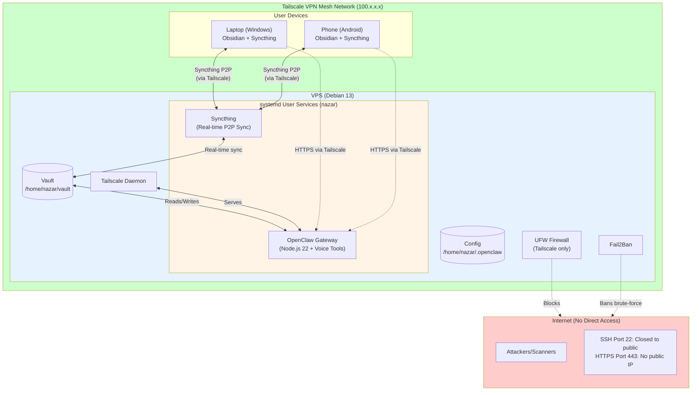
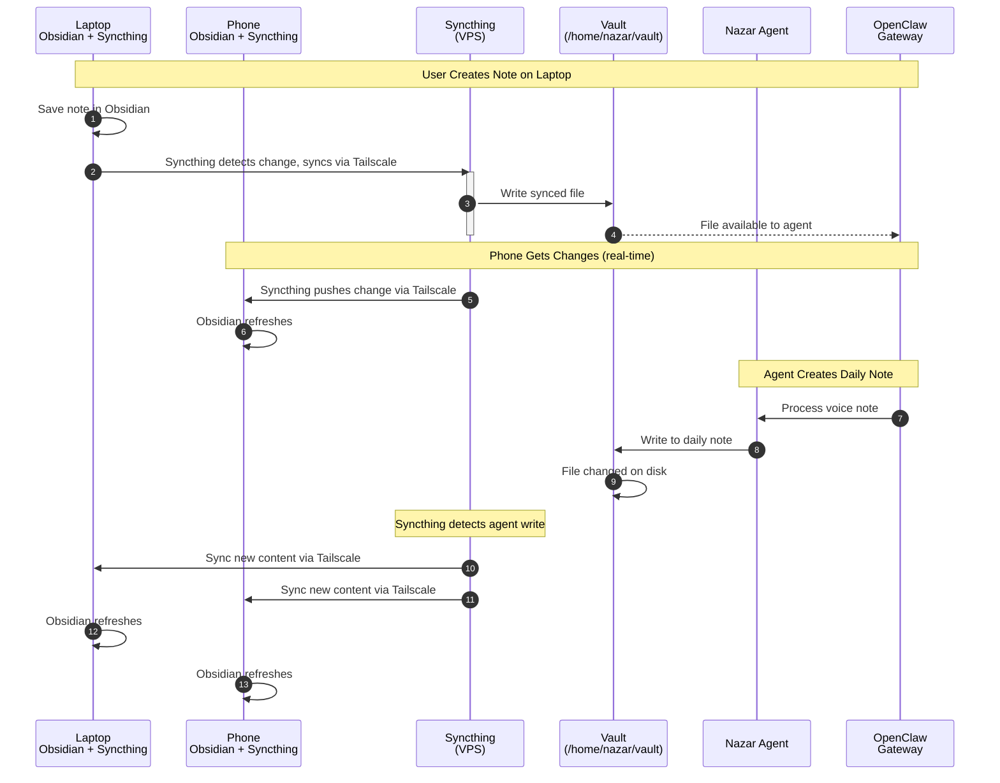
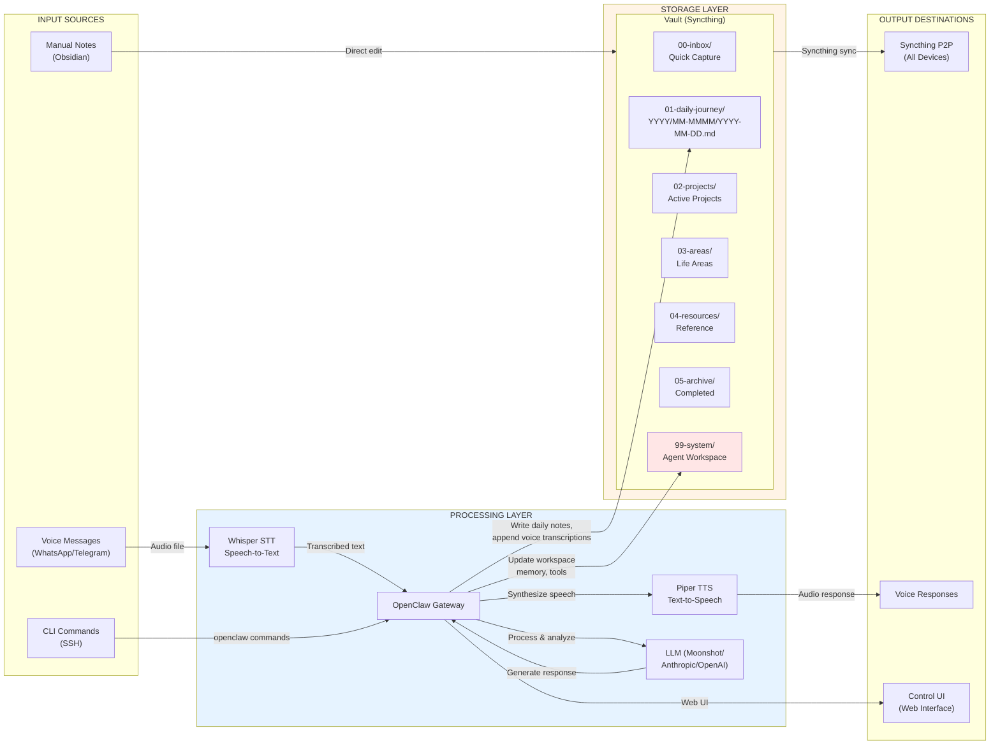
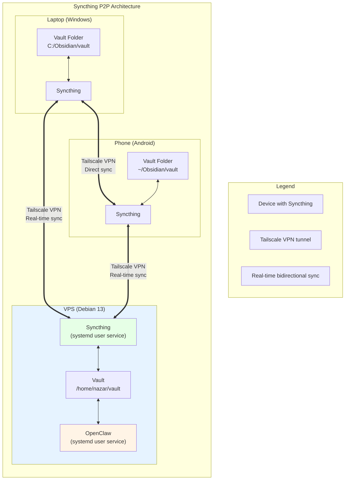
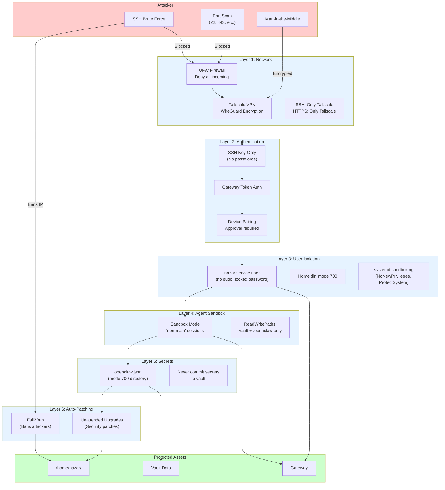
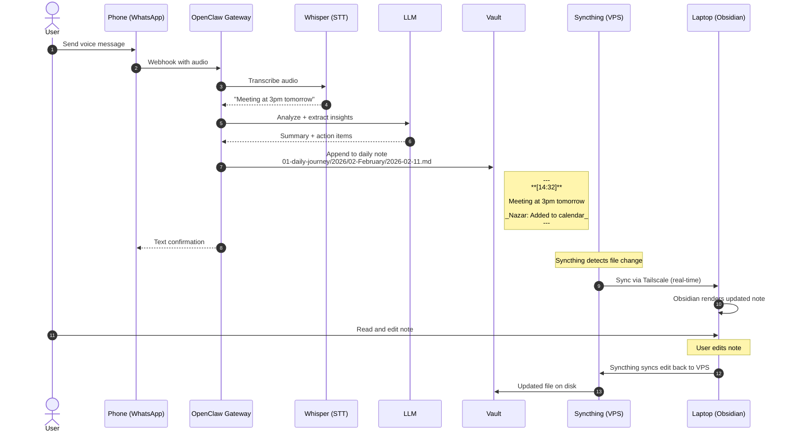
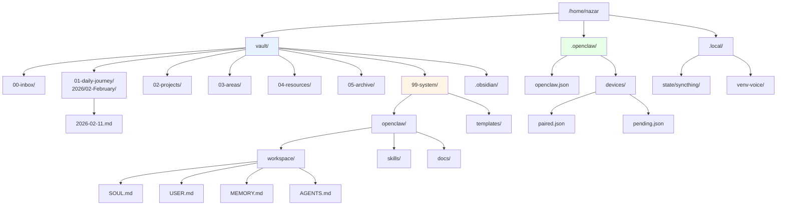
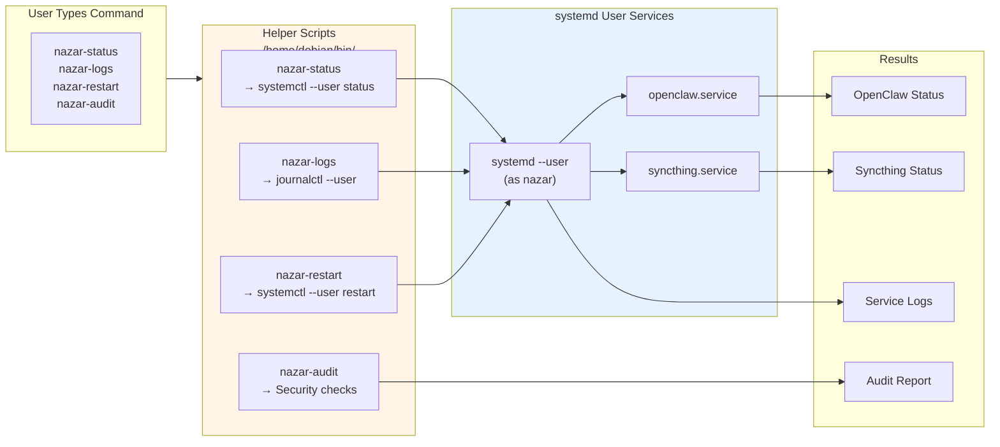
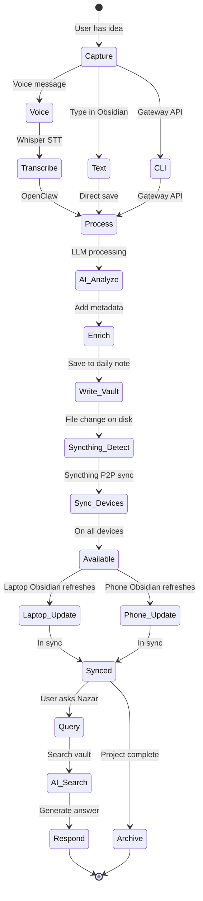

# Nazar Second Brain - Infrastructure Diagrams

Complete visual documentation of the system architecture, data flows, and synchronization mechanisms.

---

## 1. High-Level System Architecture

---

## 2. Syncthing Synchronization Flow (Detailed)

---

## 3. Data Flow Architecture

---

## 4. Syncthing Sync Topology

---

## 5. Security Architecture (Defense in Depth)

---

## 6. Request Flow Example (Voice Note Processing)

---

## 7. Directory Structure (Tree View)

---

## 8. Command & Service Reference Map

---

## 9. Complete Data Lifecycle

---

## Legend

| Symbol | Meaning |
|--------|---------|
| Solid arrow | Direct data flow |
| Dashed arrow | Trigger/indirect |
| Double arrow | Bidirectional Syncthing sync |
| systemd | User-scoped service (runs as nazar) |
| Tailscale | WireGuard VPN mesh (100.x.x.x) |

---

*Generated: 2026-02-11*
*For interactive viewing, use a Mermaid-compatible markdown viewer or paste into [Mermaid Live Editor](https://mermaid.live)*
